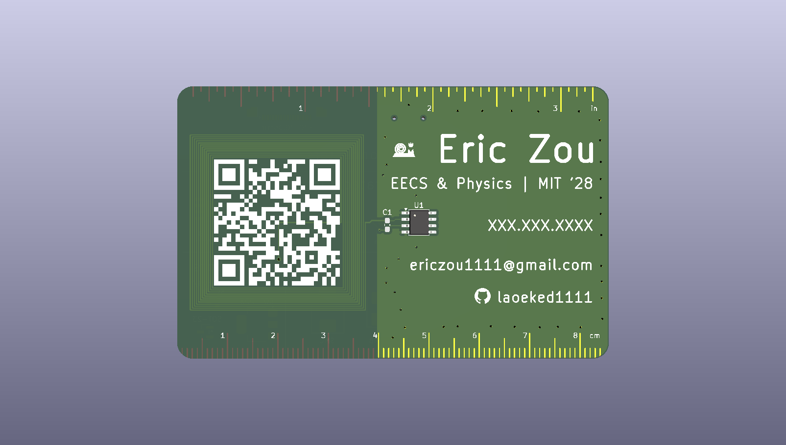
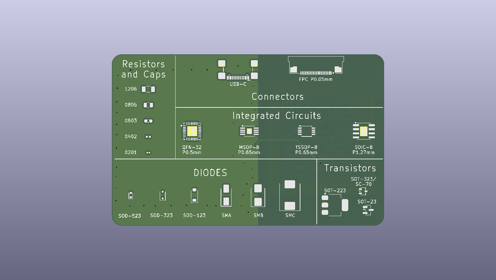

# pcb-business-card

This is a PCB business card/ruler that I made. On the front is a QR code to my LinkedIn, a NFC chip to bring the user to a website, my contact information, 
and a imperial and metric ruler. On the back are some commonly used SMD footprints.

